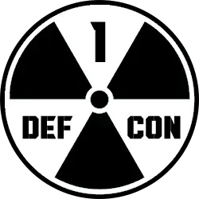

# DEFCON 1

## Visual Error Monitor for VS Code

DEFCON 1 is a visual monitoring extension that drastically changes your workspace colors based on the number of errors in your project. It acts as an immediate visual feedback loop, ensuring you never miss a breaking change or a syntax error.

## Features

-   **Dynamic Visual Alerts**: Your Title Bar, Status Bar, and Activity Bar change color based on the number of errors (diagnostics) in your workspace.
-   **Customizable Levels**: Define 5 "DEFCON" levels, from DEFCON 5 (Safe) to DEFCON 1 (Critical).
-   **Status Bar Indicator**: A minimal status bar item displays the current level and the number of error.
-   **Configuration Panel**: A dedicated Webview panel to customize:
    -   **Thresholds**: How many errors trigger each level.
    -   **Colors**: Pick any color for each level.
    -   **Targets**: Choose which UI elements (Title Bar, Status Bar, Activity Bar) are affected.

## Usage

1. **Install** the extension.
2. **Code** as usual. As errors accumulate, your VS Code window will change color.
    - **DEFCON 5 (Green)**: 0 Errors.
    - **DEFCON 4 (Blue)**: Low error count.
    - **DEFCON 3 (Yellow)**: Moderate error count.
    - **DEFCON 2 (Orange)**: High error count.
    - **DEFCON 1 (Red)**: Critical error count.
3. **Customize**:
    - Click the "DEFCON" item in the Status Bar (bottom right).
    - Or run the command `DEFCON 1: Open Settings Panel`.
    - Adjust colors, thresholds, and target areas using the interactive panel.
    - Click **Save Settings**.

## Extension Settings

This extension contributes the following settings (managed via the panel):

-   `defcon1.settings`: Stores your custom thresholds, colors, and target preferences.
